# 🏝️ Dynamic Island для Linux (GNOME)

Динамический остров в стиле iPhone, который **заменяет верхнюю панель GNOME**.
Он висит поверх всех окон, живёт своей жизнью (музыка, загрузки, уведомления, питомец),
а при наведении курсора плавно раскрывается в целую панель управления:
буфер обмена, полка файлов, ИИ-чат, голос в текст, запись экрана, OCR, лаунчер,
калькулятор, заметки, погода, мониторинг системы и многое другое.

<p align="center">
  <br>
  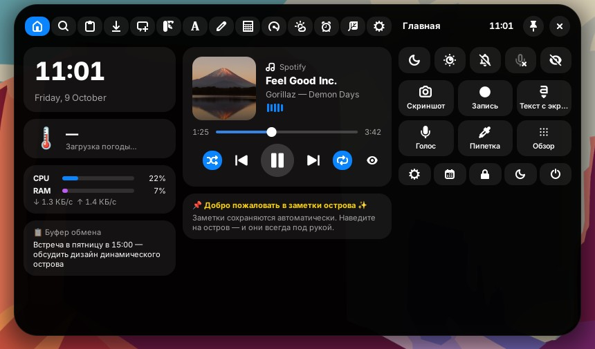
</p>

> Поддерживаются **GNOME Shell 45–50** (Ubuntu 24.04+, Fedora 39+, Arch и т. д.).
> В GNOME 50 остался только Wayland (сеанс X11 удалён), расширение работает и там, и на X11 в более старых версиях.
> Проверено вживую в GNOME Shell 46; для GNOME 50.5 все используемые API сверены с исходниками оболочки и Mutter 50.5.

---

## ✨ Возможности

| | Что умеет |
|---|---|
| 🎵 **Музыка** | Любой плеер с MPRIS (Spotify, YouTube в браузере, Rhythmbox, VLC…): обложка и анимированный эквалайзер в свёрнутом острове, карточка «Сейчас играет» с перемоткой, shuffle/repeat, переключением плееров. Смена трека — живая активность. |
| 📋 **Буфер обмена** | История текста, картинок и файлов, поиск, фильтры, закрепление ⭐, приватный режим. Пароли из менеджеров паролей не сохраняются. |
| 🗂️ **Полка файлов** | Скопировали файлы в «Файлах» (Ctrl+C) — они на полке. Можно сделать временную копию (оригинал можно удалять), вставить в любую папку, скопировать в «Загрузки»/на рабочий стол, распознать текст на картинке. |
| ⬇️ **Загрузки** | Следит за папкой «Загрузки»: Firefox, Chrome/Chromium, Edge, Yandex, Opera, Epiphany… Скорость и размер в реальном времени, уведомление о завершении. |
| 🕒 **Время, дата, FPS, нагрузка** | Часы, дата, CPU, RAM, температура, сеть, батарея, FPS композитора, раскладка — любой набор слева/по центру/справа. Вкладка «Система»: кольца, графики, загрузка ядер, топ процессов. |
| ✨ **ИИ-чат** | NVIDIA NIM (`integrate.api.nvidia.com`) или любой OpenAI-совместимый API. Потоковый вывод, Markdown, копирование кода, быстрые действия над буфером. |
| 🎙️ **Голос в текст** | Запись микрофона (PipeWire/PulseAudio/ALSA) → whisper.cpp локально или API (OpenAI, Groq…). Результат копируется, может вставляться в активное окно или уходить в ИИ. |
| ⏺️ **Запись экрана** | Встроенный рекордер GNOME: весь экран одной кнопкой или выбор области/окна. Таймер записи прямо в острове. |
| 🔤 **Фото в текст (OCR)** | Выделите область экрана — текст распознается (tesseract) и окажется в буфере. Также из картинки в буфере или с полки. |
| 🎨 **Пипетка** | Цвет любой точки экрана в HEX / RGB / HSL. |
| 🔎 **Лаунчер** | Поиск приложений, `>команда` — выполнить и показать вывод, `!команда` — в терминале, `?вопрос` — ИИ, `=2+2` — калькулятор, адреса сайтов, веб-поиск, свои быстрые команды. |
| 🧮 **Калькулятор** | Функции, степени, факториал, %, π/e, `ans`, градусы/радианы, HEX/BIN, история. |
| 📝 **Текст** | Регистр, исправление раскладки (ghbdtn → привет), транслит, типограф, сортировка, base64/URL/HTML, JSON, camel/snake/kebab-case, ИИ: «улучшить», «исправить ошибки», «перевести», «короче». |
| 🗒️ **Заметки** | С автосохранением, цветами, закреплением и поиском. |
| 🌦️ **Погода** | Open-Meteo без ключа: сейчас, по часам и на неделю. Город или автоопределение по IP. |
| ⏱️ **Таймер** | Таймер с пресетами, секундомер с кругами, помодоро 25/5. Обратный отсчёт виден в свёрнутом острове. |
| 🐈 **Питомец** | Гуляет по острову, просит есть, радуется, когда его гладят, растёт в уровнях. 19 видов, включая **Clawd** — пиксельного маскота Claude (перебирает ножками при ходьбе, моргает и спит с закрытыми глазами). |
| 🔔 **Уведомления** | Показываются внутри острова как живые активности (клик — открыть). |
| ⚙️ **Системное** | Тёмная тема, ночной свет, «Не беспокоить», микрофон, громкость, яркость, блокировка/сон/выключение, быстрые настройки и календарь GNOME. |

<p align="center">
  
  <br>
  
  
</p>

<details>
<summary><b>📸 Остальные вкладки</b></summary>

| | |
|---|---|
| 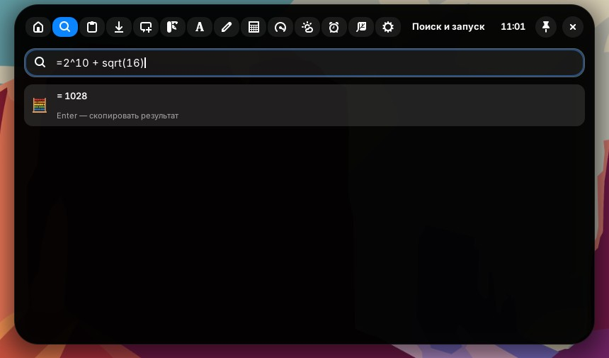 | 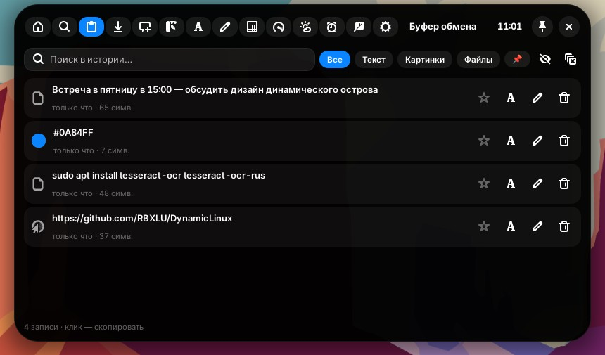 |
| 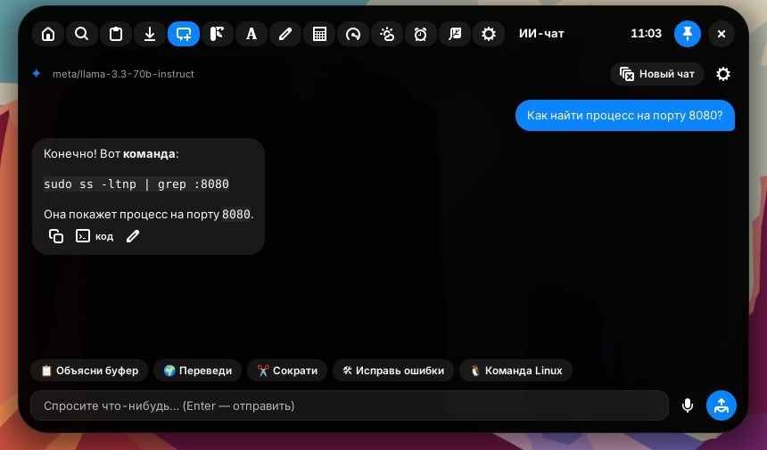 | 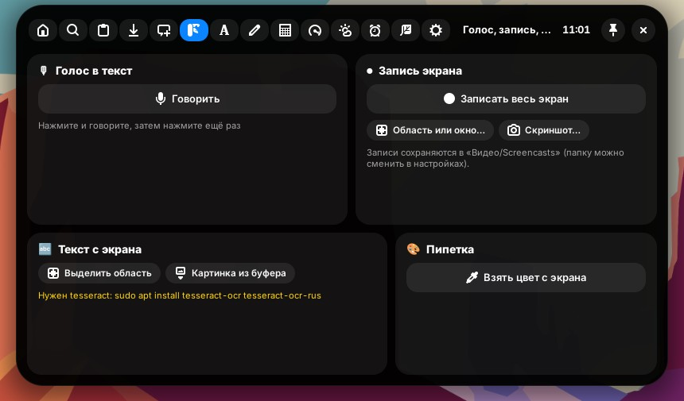 |
| 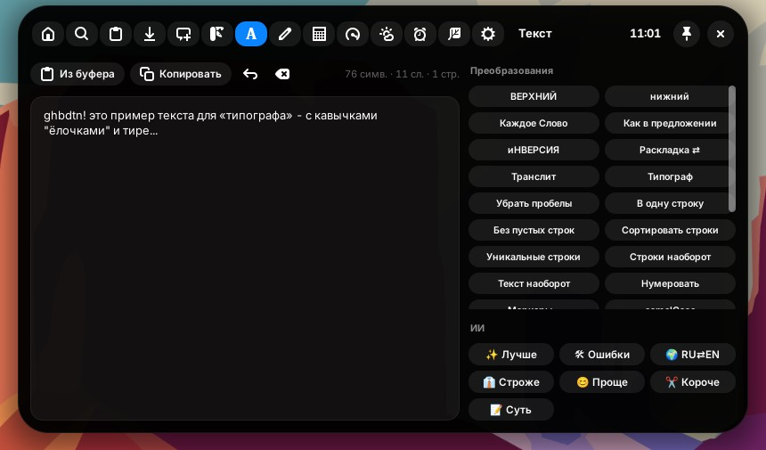 | 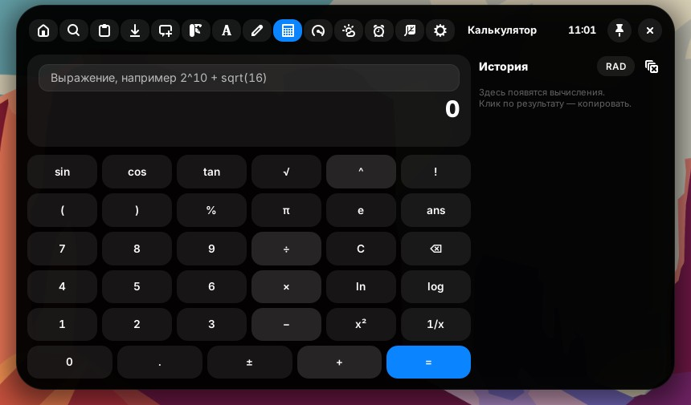 |
| 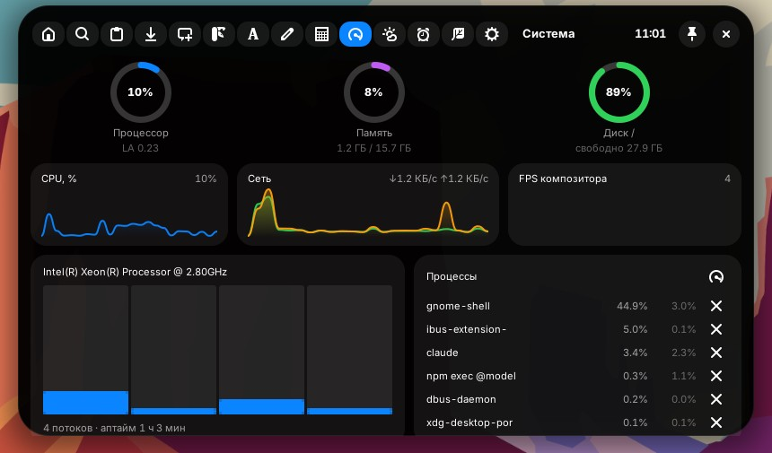 | 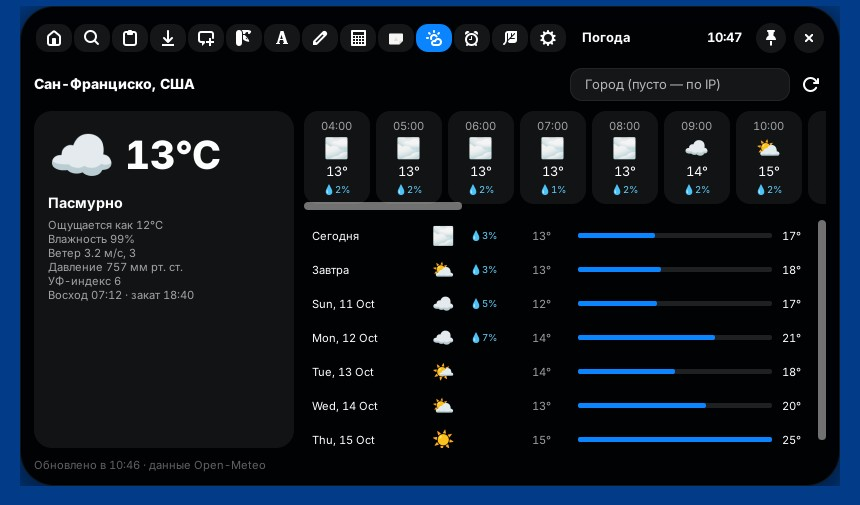 |
| 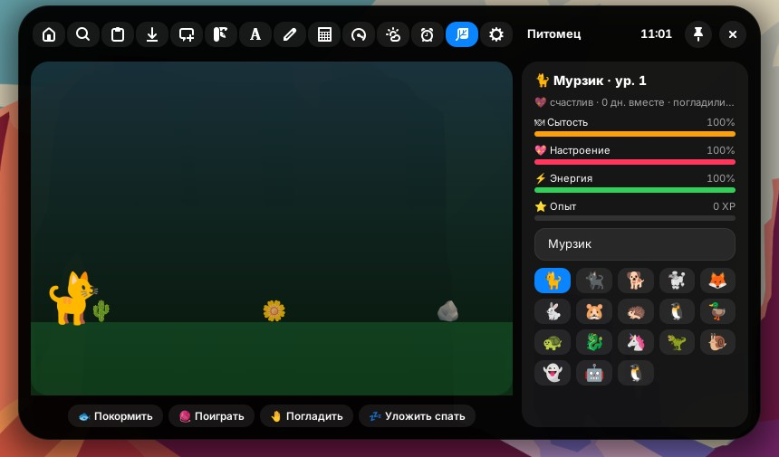 | 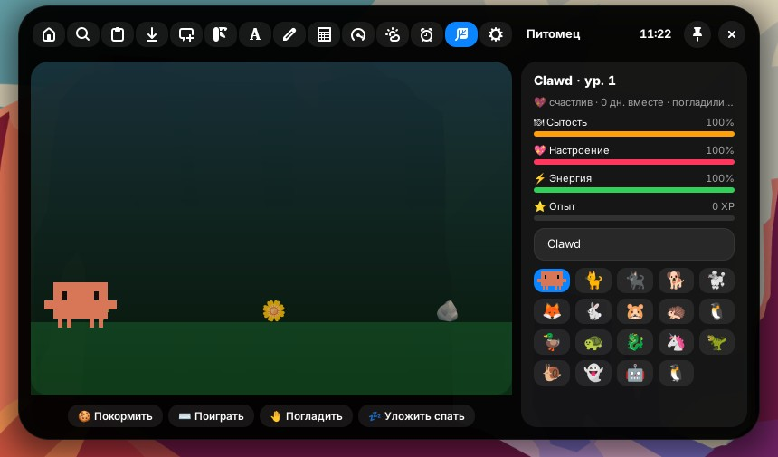 |
| 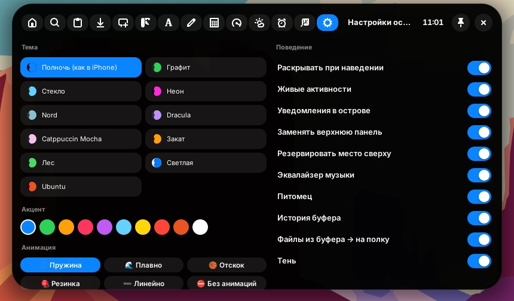 |  |

<p align="center">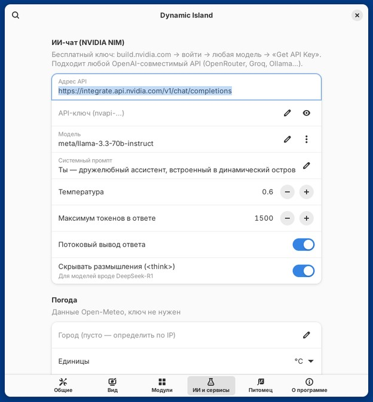</p>
</details>

---

## 🚀 Установка

```bash
git clone https://github.com/RBXLU/DynamicLinux.git
cd DynamicLinux
./install.sh            # установить и включить
./install.sh --deps     # то же + tesseract (OCR) и утилиты записи звука
```

После установки **перезапустите GNOME Shell**:

* **Wayland** (единственный вариант в GNOME 50, по умолчанию в Ubuntu/Fedora) — выйдите из системы и войдите снова;
* **X11** (только GNOME 45–49) — `Alt+F2`, введите `r`, `Enter`.

Затем, если остров не появился: `gnome-extensions enable dynamic-island@dynamiclinux`.

Удалить: `./install.sh --uninstall`. Собрать zip: `./install.sh --pack`.

### Включить / выключить

* `Super+Alt+D` — спрятать остров и вернуть обычную панель (и обратно);
* или в приложении «Расширения» / `gnome-extensions disable dynamic-island@dynamiclinux`;
* или в самом острове: вкладка ⚙️ → «Выключить остров».

### Необязательные зависимости

| Функция | Что нужно |
|---|---|
| OCR (текст с экрана) | `tesseract-ocr tesseract-ocr-rus` |
| Голос в текст (локально) | [whisper.cpp](https://github.com/ggerganov/whisper.cpp) (`whisper-cli`) + модель, либо API в настройках |
| Запись микрофона | `pw-record` (PipeWire), `parecord`, `arecord` или `ffmpeg` — обычно уже есть |
| ИИ-чат | Бесплатный ключ NVIDIA NIM: [build.nvidia.com](https://build.nvidia.com) → войти → любая модель → **Get API Key** |

<details>
<summary>Как поставить whisper.cpp для локального распознавания речи</summary>

```bash
git clone https://github.com/ggerganov/whisper.cpp ~/whisper.cpp
cd ~/whisper.cpp && cmake -B build && cmake --build build -j --config Release
sudo cp build/bin/whisper-cli /usr/local/bin/
mkdir -p ~/.local/share/whisper
sh ./models/download-ggml-model.sh base   # или small / medium для лучшего качества
cp models/ggml-base.bin ~/.local/share/whisper/
```

Команда по умолчанию в настройках уже настроена на этот путь:
`whisper-cli -m ~/.local/share/whisper/ggml-base.bin -l {lang} -nt -np -f {file}`
</details>

---

## 🖱️ Управление

| Действие | Результат |
|---|---|
| Навести курсор | Остров раскрывается (задержку можно настроить или отключить) |
| Клик по острову | Раскрыть и «закрепить» — работает ввод с клавиатуры |
| Клик вне острова / `Esc` | Свернуть |
| Средняя кнопка мыши | Пауза / воспроизведение |
| Правая кнопка мыши | Сразу открыть настройки острова |
| Колесо мыши над островом | Громкость |
| `Super+Alt+Space` | Раскрыть с поиском (как Spotlight) |
| `Alt+1…9`, `Ctrl+Tab` | Переключение вкладок |

## 🎨 Настройка

Всё настраивается в окне параметров (`gnome-extensions prefs dynamic-island@dynamiclinux`)
или прямо в острове на вкладке ⚙️:

* **Вид:** 11 готовых тем (Полночь, Графит, Стекло, Неон, Nord, Dracula, Catppuccin, Закат, Лес, Светлая, Ubuntu) или свои цвета фона/текста/акцента/рамки, размеры, скругления, отступ, шрифт, тень, размытие.
* **Анимации:** пружина (как в iPhone), плавно, отскок, резинка, линейно или без анимаций; длительность; анимация переключения вкладок; эквалайзер.
* **Модули:** какие виджеты показывать в свёрнутом острове и где (слева/центр/справа), какие вкладки включены, формат часов и даты.
* **Поведение:** раскрытие по наведению, задержки, замена панели, резерв места сверху, скрытие в полноэкранном режиме, уведомления в острове, источники живых активностей.
* **ИИ и сервисы:** адрес API, ключ, модель (с готовым списком моделей NVIDIA NIM), системный промпт, температура; погода; распознавание речи; OCR; папка записей экрана; терминал; поисковик; быстрые команды.

---

## 🧩 Как это устроено

```
dynamic-island@dynamiclinux/
├── extension.js        — жизненный цикл, замена панели GNOME, горячие клавиши, живые активности
├── prefs.js            — окно настроек (GTK4 + libadwaita)
├── stylesheet.css      — стили
├── schemas/            — все настройки (GSettings)
└── lib/
    ├── island.js       — сам остров: состояния, анимации формы, наведение, модальный режим
    ├── theme.js        — тема и параметры анимаций
    ├── ui/             — свёрнутый вид, живые активности, раскрытый вид, карточка музыки, виджеты
    ├── pages/          — вкладки: главная, лаунчер, буфер, полка, ИИ, инструменты, текст…
    ├── services/       — MPRIS, буфер, полка, загрузки, погода, ИИ, голос, запись, OCR, питомец…
    └── pure/           — чистая логика без GNOME: калькулятор, текст, форматирование (с тестами)
```

Данные хранятся в `~/.local/share/dynamic-island/` (заметки, история буфера, чат, полка),
кэш — в `~/.cache/dynamic-island/`.

### Разработка

```bash
npx eslint .                 # проверка кода
gjs -m tests/pure.test.js    # тесты калькулятора и текстовых инструментов
journalctl -f -o cat /usr/bin/gnome-shell | grep dynamic-island   # логи расширения
```

## ❓ Частые вопросы

* **Пропала верхняя панель, где Wi-Fi и звук?** Раскройте остров → кнопки ⚙️ (быстрые настройки GNOME) и 📅 (календарь/уведомления) в правой колонке. Громкость и яркость — там же. Панель также видна в «Обзоре».
* **Окна заходят под остров.** Включите «Резервировать место сверху».
* **ИИ отвечает 401/403.** Проверьте ключ NVIDIA NIM (начинается с `nvapi-`) и модель.
* **OCR ничего не находит.** Установите `tesseract-ocr-rus`, проверьте «Языки tesseract» (`rus+eng`).
* **Запись экрана не стартует.** Нужен PipeWire (есть во всех современных дистрибутивах).

## Лицензия

GPL-3.0 — см. [LICENSE](LICENSE).
